# Schéma de la Base de Données

## Diagramme ERD (Mermaid)

```mermaid
erDiagram
    membres {
        uuid id PK
        text nom
        text prenom
        text telephone
        text email
        text statut
        uuid user_id FK
        boolean est_membre_e2d
        boolean est_adherent_phoenix
    }

    profiles {
        uuid id PK
        text nom
        text prenom
        text email
        boolean must_change_password
    }

    roles {
        uuid id PK
        text name
    }

    user_roles {
        uuid id PK
        uuid user_id FK
        uuid role_id FK
    }

    membres_roles {
        uuid id PK
        uuid membre_id FK
        uuid role_id FK
    }

    exercices {
        uuid id PK
        text nom
        date date_debut
        date date_fin
        text statut
        numeric taux_interet_prets
    }

    cotisations_types {
        uuid id PK
        text nom
        numeric montant_defaut
        boolean obligatoire
    }

    cotisations {
        uuid id PK
        uuid membre_id FK
        uuid type_cotisation_id FK
        uuid exercice_id FK
        uuid reunion_id FK
        numeric montant
        text statut
        date date_paiement
    }

    reunions {
        uuid id PK
        text sujet
        date date_reunion
        text statut
        text compte_rendu
    }

    reunions_presences {
        uuid id PK
        uuid reunion_id FK
        uuid membre_id FK
        text statut
    }

    reunions_sanctions {
        uuid id PK
        uuid reunion_id FK
        uuid membre_id FK
        text motif
        numeric montant_amende
        text statut
    }

    epargnes {
        uuid id PK
        uuid membre_id FK
        uuid exercice_id FK
        uuid reunion_id FK
        numeric montant
        date date_depot
        text statut
    }

    prets {
        uuid id PK
        uuid membre_id FK
        numeric montant
        numeric montant_paye
        date echeance
        text statut
        numeric taux_interet
    }

    prets_paiements {
        uuid id PK
        uuid pret_id FK
        numeric montant_paye
        date date_paiement
    }

    aides {
        uuid id PK
        uuid beneficiaire_id FK
        uuid type_aide_id FK
        uuid exercice_id FK
        numeric montant
        text statut
    }

    fond_caisse_operations {
        uuid id PK
        text type_operation
        numeric montant
        text libelle
        text categorie
        uuid operateur_id FK
        uuid beneficiaire_id FK
        uuid reunion_id FK
        uuid exercice_id FK
        text source_table
        uuid source_id
        date date_operation
    }

    donations {
        uuid id PK
        text donor_name
        text donor_email
        numeric amount
        text payment_method
        text payment_status
    }

    sport_e2d_matchs {
        uuid id PK
        date date_match
        text adversaire
        integer score_e2d
        integer score_adversaire
    }

    membres ||--o{ cotisations : "paie"
    membres ||--o{ epargnes : "épargne"
    membres ||--o{ prets : "emprunte"
    membres ||--o{ aides : "reçoit"
    membres ||--o{ reunions_presences : "participe"
    membres ||--o{ reunions_sanctions : "sanctionné"
    membres ||--o{ membres_roles : "a rôle"
    membres ||--o{ fond_caisse_operations : "opère"
    roles ||--o{ membres_roles : ""
    roles ||--o{ user_roles : ""
    exercices ||--o{ cotisations : ""
    exercices ||--o{ epargnes : ""
    cotisations_types ||--o{ cotisations : ""
    reunions ||--o{ cotisations : ""
    reunions ||--o{ reunions_presences : ""
    reunions ||--o{ reunions_sanctions : ""
    reunions ||--o{ fond_caisse_operations : ""
    prets ||--o{ prets_paiements : ""
```

## Tables principales

| Table | Description | Rows estimées |
|-------|-------------|---------------|
| `membres` | Membres de l'association | ~50-200 |
| `cotisations` | Paiements de cotisations par réunion | ~1000+ |
| `epargnes` | Dépôts d'épargne | ~500+ |
| `prets` | Prêts accordés aux membres | ~50-100 |
| `reunions` | Réunions mensuelles | ~100+ |
| `fond_caisse_operations` | Journal comptable (source de vérité financière) | ~5000+ |
| `donations` | Dons reçus | ~50+ |

## Triggers automatiques

- **`create_caisse_operation_from_source`** : Crée automatiquement une opération caisse quand une cotisation est payée, une épargne déposée, un prêt accordé, etc.
- **`sync_sanction_to_caisse`** : Synchronise les sanctions payées vers la caisse
- **`update_pret_amounts`** : Recalcule le montant payé d'un prêt après un paiement
- **`log_membre_activity`** : Journalise les activités des membres
- **`sync_membre_to_profile`** : Synchronise les données membre vers le profil utilisateur
